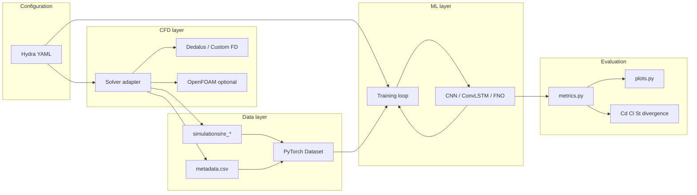
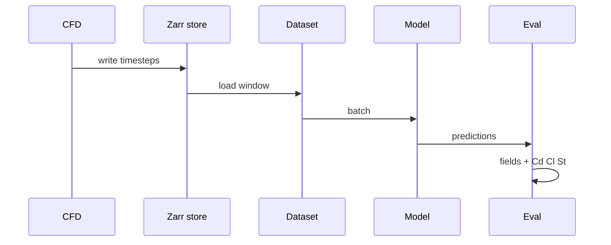

# System Architecture

This document describes the **target architecture** for the FFAO ML project: how CFD simulation, datasets, models, training, and evaluation connect. Requirements live in [PRD.md](./PRD.md); technology choices in [TECH_STACK.md](./TECH_STACK.md).

---

## 1. Purpose and scope

The system answers whether ML models can **learn temporal dynamics** of 2D incompressible flow around a cylinder and **generalize across Reynolds numbers** not seen in training, while preserving interpretable physical quantities (Cd, Cl, St, divergence).

**In scope (v1):**

- Low-to-moderate resolution 2D simulations and exported time series.
- Tasks A–D (reconstruction, one-step, multi-step, Re-conditioned prediction).
- Simulation-level train/val/test splits and documented metrics/visualizations.

**Out of scope (v1):** 3D industrial CFD, real-time solvers, claims that ML replaces professional CFD (PRD §3).

---

## 2. High-level system view



**Control flow:** configuration drives simulation batches and training runs. **Data flow:** solver → chunked field files + metadata → datasets → models → metrics and figures under `results/`.

---

## 3. Architectural layers

### 3.1 Configuration layer

- **Location:** `configs/`
- **Responsibility:** Single source of truth for domain geometry, physical parameters, Re lists per split, model architecture, loss weights (e.g. λ for divergence penalty), paths, and seeds.
- **Outputs:** Resolved config snapshot written into each run directory for reproducibility (PRD §17).

Typical config groups:

| Group | Examples |
|-------|----------|
| `simulation` | domain size, D, U, ν, Δt, T_end, resolution |
| `dataset` | output root, train/val/test Re lists, normalization |
| `model` | type, channels, hidden size, Re embedding |
| `train` | batch size, lr, epochs, checkpoint interval |
| `eval` | horizons, physical metric toggles |

### 3.2 Physics layer

- **Location:** `src/physics/`
- **Responsibility:** Dimensionless numbers and integral quantities **independent of CFD backend**.

| Module | Responsibility |
|--------|----------------|
| `reynolds.py` | Re from U, D, ν |
| `navier_stokes.py` | References, divergence helpers (NumPy; mirrored in Torch for losses) |
| `coefficients.py` | Cd, Cl from surface forces; Strouhal from lift signal |

Used for: validating simulations before ML, and scoring ML rollouts against ground-truth physics.

### 3.3 CFD layer

- **Location:** `src/cfd/`
- **Pattern:** **Adapter interface** — all solvers implement the same contract.

```text
Solver.run(case_config) -> SimulationResult
SimulationResult: paths to field stores, metadata dict, optional force time series
```

| Module | Responsibility |
|--------|----------------|
| `solver.py` | Abstract interface + factory (`get_solver(name)`) |
| `mesh.py` | Grid generation, cylinder mask, boundary tagging |
| `dedalus_backend.py` | Dedalus implementation (v1 default when enabled) |
| `fd_backend.py` | Custom finite-difference implementation |
| `adapters/openfoam.py` | Optional: case template, run, convert to Zarr/xarray |

**Principle:** ML and `src/data/` only read **normalized export format**, not solver-native files.

### 3.4 Data layer

- **Location:** `src/data/`
- **Responsibility:** Generate datasets, preprocess, expose PyTorch samples.

| Module | Responsibility |
|--------|----------------|
| `generation.py` | Batch runs over Re; writes `dataset/simulations/...` and updates `metadata.csv` |
| `preprocessing.py` | Normalization stats (fit on train Re only), optional downsampling, train/val/test masks |
| `dataset.py` | `FlowDataset`: windows for tasks A–D; returns tensors + Re + time index |

**Sample content (logical):**

```text
reynolds_number, time, u_x, u_y, pressure, vorticity  (+ optional boundary/mask)
```

**Splitting:** Rows in `metadata.csv` tagged `split=train|val|test` by Re list — no frame-level random split (PRD §11).

### 3.5 Model layer

- **Location:** `src/models/`
- **Responsibility:** Architectures and forward passes only (no training logic).

| Module | Maps to PRD |
|--------|-------------|
| Baselines in `baselines.py` or training script | Persistence, linear |
| `cnn.py` | One-step spatial predictor |
| `convlstm.py` | Temporal / multi-step |
| `neural_operator.py` | FNO (neuraloperator) |
| `conditioning.py` | Re embedding / extra input channels (Task D) |

**Inputs:** Stacked channels `[u_x, u_y, p, ω]` (subset configurable per task). **Task D:** concatenate Re (normalized) or FiLM/embedding.

### 3.6 Training layer

- **Location:** `src/training/`
- **Responsibility:** Losses, optimization, checkpoints, optional multi-step rollout during training.

| Concern | Approach |
|---------|----------|
| Data loss | MSE on selected fields |
| Physics-informed (Exp. 5) | `L = L_data + λ L_div` with discrete ∇·u on predicted velocity |
| Multi-step (Task C) | Unroll in eval; optional truncated unroll in train |
| Checkpoints | `results/<run_id>/checkpoints/` |
| Logging | scalars to MLflow/W&B or `metrics.jsonl` |

Entry point: `train.py` (Hydra `@hydra.main`).

### 3.7 Evaluation layer

- **Location:** `src/evaluation/`
- **Responsibility:** Offline metrics and all PRD §13 visualizations.

| Module | Responsibility |
|--------|----------------|
| `metrics.py` | MSE, relative L², per-horizon error, Re-wise aggregates |
| `plots.py` | Fields, error maps, Cd/Cl vs time, spectra, generalization heatmaps |
| `rollout.py` | Multi-step inference and stability analysis |

Evaluation reads **checkpoints + test Re simulations**; never mutates raw CFD data.

---

## 4. ML task architecture

Tasks build on the same dataset with different `__getitem__` / collate behavior.

| Task | Input | Output | Notes |
|------|--------|--------|--------|
| **A** Reconstruction | Partial field (mask / sparse probes) | Full u, p, ω | Spatial-only or single-time |
| **B** One-step | flow(t) | flow(t+Δt) | Primary benchmark |
| **C** Multi-step | flow(t₀) | flow(t₁…tₙ) | Recursive model application; error vs horizon |
| **D** Re-conditioned | flow(t), Re | flow(t+Δt) | Single model across regimes |



---

## 5. Data flow and artifacts

### 5.1 Simulation run

1. Load `configs/simulation/*.yaml`.
2. Instantiate solver via factory.
3. Run time integration; at each step write fields to chunked array (Zarr).
4. Append row to `metadata.csv` (Re, paths, ν, U, D, resolution, Δt, seed, split).
5. Run **baseline analysis** (Cd, Cl, St) on raw simulation → `results/cfd_validation/re_*/`.

### 5.2 Training run

1. Load `configs/train/*.yaml` + model config.
2. Build datasets using train/val Re from metadata only.
3. Fit normalization on training simulations; save `preprocess_stats.json` in run dir.
4. Train with checkpointing; save `config.yaml` snapshot.

### 5.3 Evaluation run

1. Load checkpoint + same `preprocess_stats.json`.
2. Run one-step and rolled multi-step on val/test Re.
3. Compute field metrics and physical quantities from **predicted** fields (same routines as CFD validation where possible).
4. Write figures to `results/<run_id>/figures/`.

---

## 6. Repository organization (proposed)

Aligned with PRD §15 and extended for configs, adapters, and results.

```text
FFAO_ML_project/
├── README.md
├── LICENSE
├── pyproject.toml
├── documentation/
│   ├── PRD.md
│   ├── TECH_STACK.md
│   ├── ARCHITECTURE.md
│   ├── LEGAL.md
│   └── ATTRIBUTION.md
│
├── LICENSE                       # Apache 2.0 (software)
├── LICENSE-DATA                  # CC BY 4.0 (datasets & results)
├── NOTICE                        # Attribution for redistributions
├── CITATION.cff                  # Academic / software citation metadata
│
├── configs/
│   ├── config.yaml              # Hydra root defaults
│   ├── simulation/
│   │   ├── cylinder_base.yaml
│   │   └── re_sweep.yaml
│   ├── dataset/
│   │   └── splits.yaml          # train/val/test Re lists
│   ├── model/
│   │   ├── cnn.yaml
│   │   ├── convlstm.yaml
│   │   └── fno.yaml
│   └── train/
│       └── default.yaml
│
├── src/
│   └── ffaoml/                  # import package name (adjust to taste)
│       ├── __init__.py
│       ├── physics/
│       │   ├── navier_stokes.py
│       │   ├── reynolds.py
│       │   └── coefficients.py
│       ├── cfd/
│       │   ├── solver.py
│       │   ├── mesh.py
│       │   ├── fd_backend.py
│       │   ├── dedalus_backend.py
│       │   └── adapters/
│       │       └── openfoam.py
│       ├── data/
│       │   ├── generation.py
│       │   ├── preprocessing.py
│       │   └── dataset.py
│       ├── models/
│       │   ├── baselines.py
│       │   ├── cnn.py
│       │   ├── convlstm.py
│       │   ├── neural_operator.py
│       │   └── conditioning.py
│       ├── training/
│       │   ├── train.py
│       │   └── losses.py
│       └── evaluation/
│           ├── metrics.py
│           ├── plots.py
│           └── rollout.py
│
├── scripts/                     # thin CLI wrappers (optional)
│   ├── generate_dataset.py
│   ├── train.py
│   └── evaluate.py
│
├── experiments/                 # human-readable experiment notes + Hydra multirun outputs
│   └── README.md
│
├── tests/
│   ├── test_physics.py
│   ├── test_splits.py
│   ├── test_metrics.py
│   └── test_dataset.py
│
├── dataset/                     # gitignored large data (see .gitignore)
│   ├── simulations/
│   └── metadata.csv
│
└── results/                     # gitignored run outputs
    ├── cfd_validation/
    └── runs/
```

**Naming note:** PRD uses `fluid-ml/` and flat `src/physics/`; this repo uses `FFAO_ML_project` with package `ffaoml` under `src/` (standard src layout). Either is fine — pick one when scaffolding and keep imports consistent.

---

## 7. Interface contracts

### 7.1 Field tensor layout (ML)

- **Shape:** `(batch, channels, height, width)` with channels default `[u_x, u_y, p, ω]`.
- **Coordinates:** Store grid spacing Δx, Δy in metadata for derivative operators and force integration.
- **Cylinder:** Boolean mask `solid` — exclude solid cells from loss or zero fields consistently.

### 7.2 Metadata schema (`metadata.csv`)

Minimum columns:

| Column | Description |
|--------|-------------|
| `sim_id` | Unique id (e.g. `re_100_seed0`) |
| `re` | Reynolds number |
| `split` | `train` \| `val` \| `test` |
| `path` | Relative path to simulation store |
| `u_inlet`, `nu`, `diameter` | Physical inputs |
| `nx`, `ny`, `dt`, `n_steps` | Discretization |
| `seed` | RNG seed |

### 7.3 Checkpoint bundle

Each checkpoint directory should include:

- `model.pt`
- `config.yaml` (resolved Hydra config)
- `preprocess_stats.json`
- `dataset_manifest.json` (or hash of `metadata.csv`)

---

## 8. Cross-cutting concerns

### 8.1 Reproducibility

| Stage | Record |
|-------|--------|
| CFD | Re, ν, U, geometry, mesh, Δt, seed, solver name + version |
| ML | model config, dataset manifest, hyperparameters, seed, library versions |

### 8.2 Testing strategy

- **Unit:** Re formula, split logic, relative L², divergence on synthetic fields.
- **Integration (light):** Tiny FD simulation → few steps → dataset window → one training step.
- **Regression (optional):** Frozen small tensor + expected metric value.

### 8.3 Performance

- Prefer **chunked Zarr** along time for I/O-bound training.
- Cache normalization and small indices in memory; use `num_workers` in DataLoader when stable on platform.
- FNO and large ConvLSTM: GPU training; keep CPU path for CI with micro-grids.

### 8.4 Security and ops

- No secrets in repo; optional API keys for W&B via environment variables.
- Large artifacts only under `dataset/` and `results/` (gitignored); optional DVC remote.

### 8.5 Licensing and redistribution

Artifacts produced by this architecture fall under two licenses (see [LEGAL.md](./LEGAL.md)):

| Path / artifact | Typical license |
|-----------------|-----------------|
| `src/`, `configs/`, `scripts/`, `tests/` | Apache 2.0 |
| `dataset/`, `results/`, released checkpoints and figures | CC BY 4.0 |

Redistributions of code must retain [LICENSE](../LICENSE) and [NOTICE](../NOTICE). Uses of published data or results must credit the FFAO ML Project per [ATTRIBUTION.md](./ATTRIBUTION.md). Dataset manifests should record version/commit for citation ([PRD.md](./PRD.md) §17, §21).

---

## 9. Research experiments (mapping)

| PRD experiment | Architectural hook |
|----------------|-------------------|
| Exp 1 — seen Re | `split=train` Re, standard val metrics |
| Exp 2 — interpolation | val Re between train Re |
| Exp 3 — extrapolation | `split=test` Re beyond train range |
| Exp 4 — predict ω directly | model output channels / ablation config |
| Exp 5 — physics-informed loss | `losses.py` + `λ` in config |

---

## 10. Evolution roadmap

| Phase | Deliverable |
|-------|-------------|
| **Phase 0** | Repo scaffold, physics tests, custom FD or Dedalus smoke test |
| **Phase 1** | Dataset generation + CFD validation plots (Cd, Cl, St) |
| **Phase 2** | Baselines + CNN one-step (Task B) |
| **Phase 3** | ConvLSTM multi-step (Task C) + horizon metrics |
| **Phase 4** | Re-conditioned model (Task D) + generalization heatmaps |
| **Phase 5** | FNO, divergence loss, optional OpenFOAM adapter |

---

## 11. Related documents

- [PRD.md](./PRD.md) — requirements and success criteria
- [TECH_STACK.md](./TECH_STACK.md) — libraries, optional groups, platform notes
- [LEGAL.md](./LEGAL.md) — licensing overview
- [ATTRIBUTION.md](./ATTRIBUTION.md) — how to give credit
- [CONTRACTS.md](./CONTRACTS.md) — field tensors, masks, `metadata.csv`
- [DATA_SOURCES.md](./DATA_SOURCES.md) — staged external datasets (Stage 1–3)
- [REPRODUCIBILITY.md](./REPRODUCIBILITY.md) — `manifest.json` and checkpoint bundles
